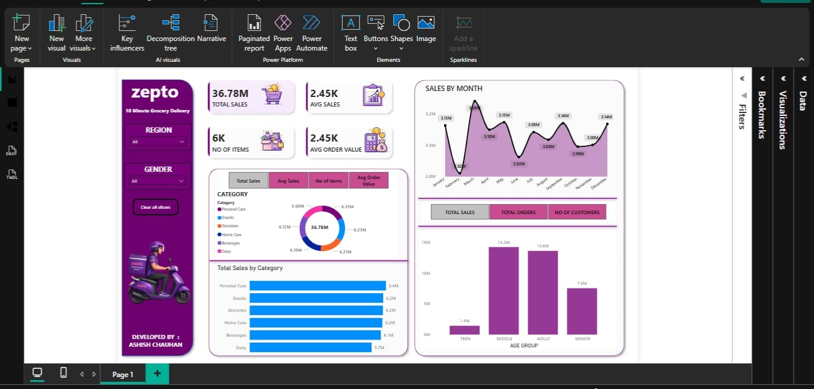

# 📊 Zepto Sales Dashboard (Power BI)

## 🔍 Overview

This project analyzes **Zepto's sales performance** using Power BI. The dashboard provides actionable insights into sales trends, customer behavior, product category performance, and order metrics. It is designed to help stakeholders make data-driven decisions through interactive visualizations and KPIs.

---

## 📌 Key Metrics

* **Total Sales:** ₹36.78M
* **Average Sales:** ₹2.45K
* **Number of Items Sold:** 6K
* **Average Order Value:** ₹2.45K

---

## ❓ Business Questions Solved

* What is the overall sales performance of Zepto?
* Which product categories generate the highest revenue?
* How do sales vary across different months?
* Which customer age groups contribute the most to sales?
* What is the average order value across all transactions?
* How many items are sold across different product categories?

---

## 📊 Dashboard Features

* Interactive slicers for **Region** and **Gender**
* KPI cards for monitoring key business metrics
* Monthly sales trend analysis
* Category-wise sales distribution
* Age-group based customer analysis
* Modern and visually appealing dashboard design
* Dynamic filtering and drill-down capabilities

---

## 💡 Key Insights

* **Personal Care** is the highest revenue-generating category.
* Sales remain relatively stable throughout the year with noticeable peaks in certain months.
* **Middle-aged and Adult** customers contribute the largest share of total sales.
* Revenue is distributed fairly evenly across categories, indicating a diversified product portfolio.
* The average order value suggests strong customer purchasing behavior.

---

## 📈 Dashboard Visualizations

### Sales Overview

* Total Sales
* Average Sales
* Number of Items
* Average Order Value

### Category Analysis

* Total Sales by Category
* Category-wise Revenue Contribution

### Trend Analysis

* Monthly Sales Trend

### Customer Analysis

* Sales by Age Group
* Gender and Region Filters

---

## 🛠️ Tools & Technologies Used

* **Power BI**
* **Microsoft Excel / CSV**
* **DAX (Data Analysis Expressions)**
* **Data Cleaning & Transformation**
* **Interactive Data Visualization**

---

## 📷 Dashboard Preview

---

## 🚀 How to Use

1. Download the `.pbix` file.
2. Open it using **Power BI Desktop**.
3. Interact with the filters and visualizations.
4. Explore business insights through dynamic dashboards.

---

## 📁 Files Included

* `zepto_better_dash.pbix`
* `Zepto_Dataset.xlsx`
* 'zepto_master_clean'
* `dashboard_output.jpeg`
* 'zepto.ipynb'
* `README.md`

---

## 🎯 Skills Demonstrated

* Data Cleaning & Transformation
* Data Modeling
* DAX Calculations
* KPI Development
* Dashboard Design
* Business Intelligence
* Data Storytelling

---

## 👨‍💻 About Me

I am **Ashish Chauhan**, a Data Analyst enthusiast passionate about transforming raw data into meaningful insights. This project demonstrates my skills in **Power BI, data visualization, business analysis, and dashboard development** to solve real-world business problems.

### Connect With Me

* LinkedIn: https://www.linkedin.com/in/not-ashishchauhan

---

⭐ If you found this project helpful, consider giving it a **star** on GitHub!
